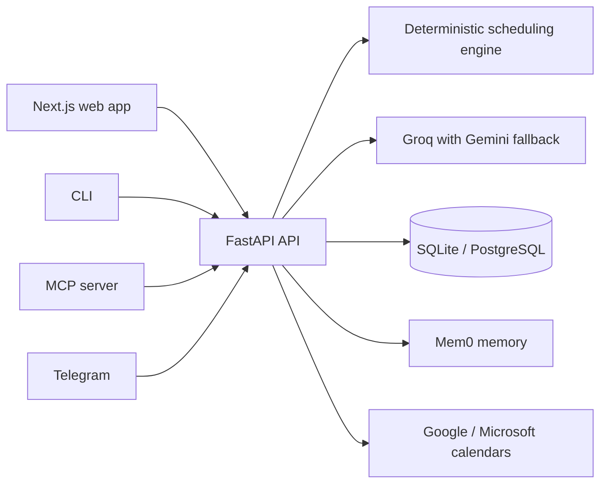

# Scedly

[](https://github.com/Medhansh2407/Scedly/actions/workflows/ci.yml)

Scedly is a local-first scheduling agent that turns natural-language intent into a constraint-aware calendar, then repairs the plan when priorities or available time change.

**[Try the zero-login guided demo](https://scedly.vercel.app/demo)** · [Open the product site](https://scedly.vercel.app) · [View the source](https://github.com/Medhansh2407/Scedly)

The guided demo is a safe, deterministic product tour with seeded tasks. It needs no account, API key, or persistent data. The authenticated application connects the same interface to the FastAPI scheduling and LLM backend.

## What it demonstrates

- Natural-language task extraction and scheduling
- Deadline, working-window, energy, and conflict constraints
- Missed-time recovery and partial-task continuation
- Day, week, and month calendar views
- Persistent preferences, chat history, and user-isolated tasks
- Web, CLI, Telegram, calendar-sync, and MCP surfaces

## Architecture



The scheduling engine owns hard constraints and conflict handling. The LLM translates conversational intent into structured operations; it does not silently override scheduling rules.

## Try it in two minutes

1. Open [scedly.vercel.app/demo](https://scedly.vercel.app/demo).
2. Click **Schedule work**, **Repair the day**, **Partial progress**, or **Explain placement**.
3. Watch the calendar and explanation update together.
4. Use **Reset** to replay the tour.

## Run locally

Tested with Python 3.13 and Node.js 24.

### Backend

```powershell
cd backend
python -m venv .venv
.venv\Scripts\Activate.ps1
pip install -r requirements.txt
Copy-Item .env.example .env.local
```

Set the minimal local configuration in `backend/.env.local`:

```env
DATABASE_URL=sqlite:///./scedly_local.db
LOCAL_DEV_MODE=true
```

Start the API:

```powershell
python -m uvicorn app.main:app --reload --host 127.0.0.1 --port 8000
```

### Frontend

```powershell
cd frontend/scedly
npm install
Copy-Item .env.example .env.local
npm run dev -- --hostname 127.0.0.1 --port 3000
```

Open [http://127.0.0.1:3000](http://127.0.0.1:3000).

The guided demo and calendar UI work without external credentials. Free-form AI chat requires `GROQ_API_KEY` in `backend/.env.local`. Provider credentials always remain server-side.

## Optional integrations

| Capability | Required configuration | Needed for guided demo? |
|---|---|---:|
| Free-form AI chat | `GROQ_API_KEY` | No |
| Gemini fallback | `GOOGLE_API_KEY` | No |
| Hosted authentication | Supabase URL, anon key, JWT secret | No |
| Long-term memory | `MEM0_API_KEY`, `HF_API_TOKEN` | No |
| Google / Outlook sync | Provider OAuth credentials | No |
| Telegram | Bot token and webhook secret | No |
| Billing | Stripe test credentials | No |

## Validate

```powershell
cd backend
python -m pytest -ra
ruff check app tests

cd ../frontend/scedly
npm run lint
npx tsc --noEmit
npm run build
npm audit

cd ../../cli-package
python -m pytest -q
ruff check scedly tests
```

The default backend suite is deterministic and credential-free. Four tests marked `integration` call Groq and run only when `GROQ_API_KEY` is configured:

```powershell
cd backend
$env:GROQ_API_KEY="your-key"
python -m pytest -m integration tests/test_nl_parser.py -ra
```

The same live checks are available through the manually triggered **Live LLM integration** GitHub Actions workflow, using the repository’s `GROQ_API_KEY` secret.

## Project status

Scedly is a portfolio-grade personal-use prototype. The deterministic scheduling core, API, CLI, authenticated web application, and guided demo are implemented. External provider integrations require their own sandbox credentials before production use.

## License

Scedly uses the [PolyForm Strict License 1.0.0](LICENSE). It is source-available, not OSI-approved open source. Review the license before using, modifying, or redistributing the project.
